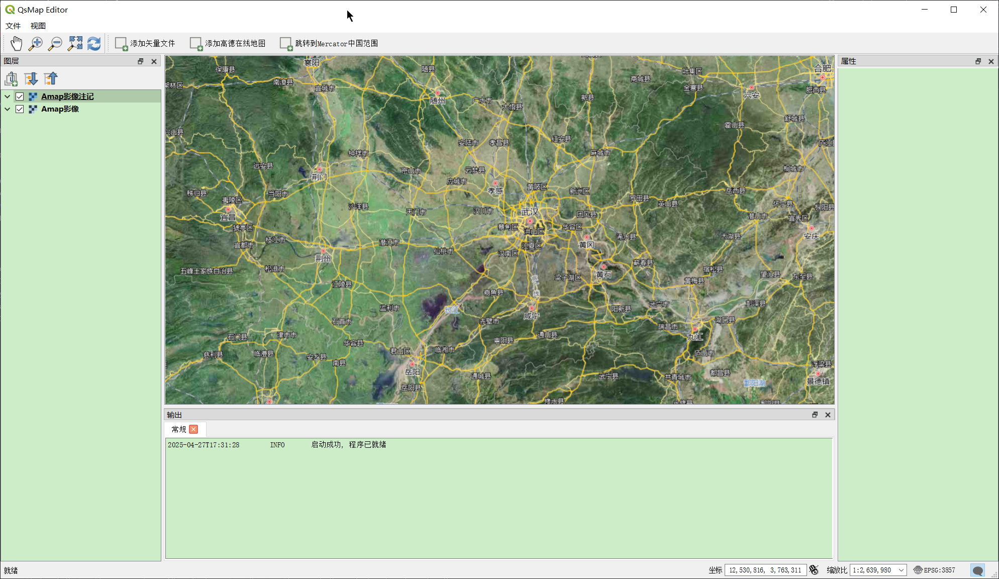

[中文版](README.zh-CN.md)|[English](README.md)

ZealMap-Open-QGIS-FX is a secondary development GIS platform based on QGIS(https://github.com/qgis/QGIS), providing a quick scaffold for building your own app.

# Features  
* It is completely open source. You can freely modify the source code.
* Support plug-in development, The development examples with built-in plugins can be referred to by you.
* only the basic interface layout is retained to facilitate the quick start of one's own customized projects.

# Example

# Setup
1. Download the development environment through OSGeo4W.
2. Install the vs qt plugin (https://marketplace.visualstudio.com/items?itemName=TheQtCompany.QtVisualStudioTools2022), and configure the qt environment directory to the qt directory in the development environment just downloaded.
3. Modify the variable information in "CMakeUserPresets.json", mainly the vcpkg and qt environments.
4. Generate the cmake cache.
5. Compile.
