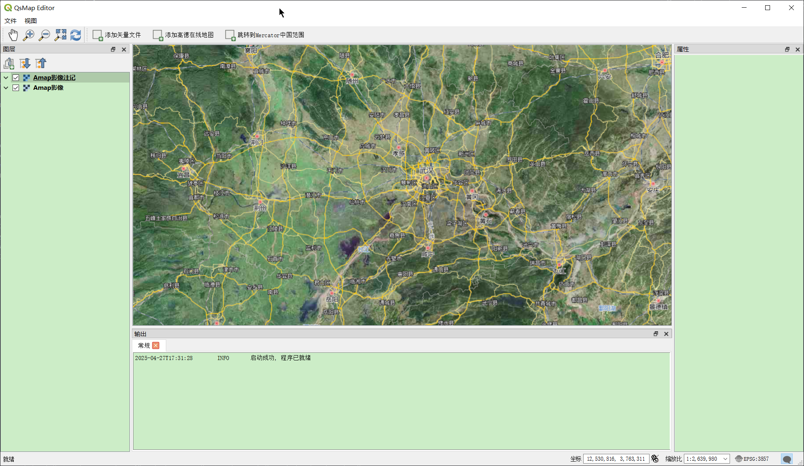

[中文版](README.zh-CN.md)|[English](README.md)

ZealMap-Open-QGIS-FX 是一个基于 QGIS（ https://github.com/qgis/QGIS ）的二次开发 GIS 平台，为构建您自己的应用程序提供快速框架。

# 功能
- 它完全开源。您可以自由修改源代码。
- 支持插件开发，您可以参考内置插件的开发示例。
- 仅保留基本的界面布局，方便您快速启动自定义项目。

# 示例

# 起步
1. 通过OSGeo4W下载开发环境
2. 安装vs qt插件(https://marketplace.visualstudio.com/items?itemName=TheQtCompany.QtVisualStudioTools2022), 配置qt环境目录到刚才下载的开发环境中的qt目录
3. 修改"CMakeUserPresets.json"中的变量信息,主要是vcpkg和qt环境
4. 生成cmake缓存
5. 编译